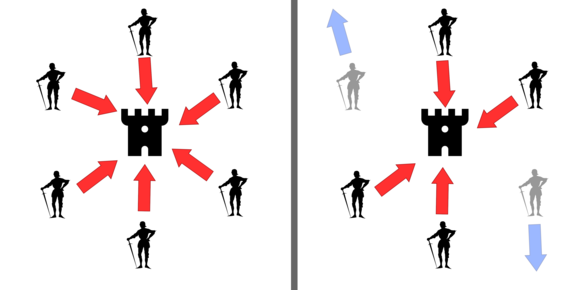
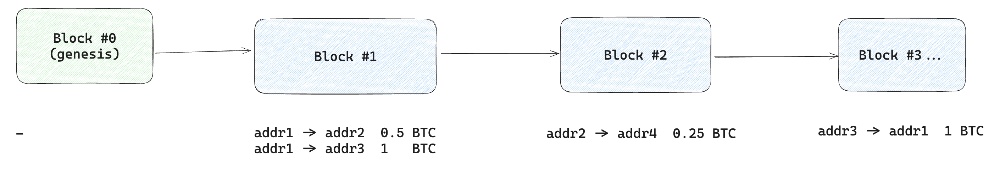
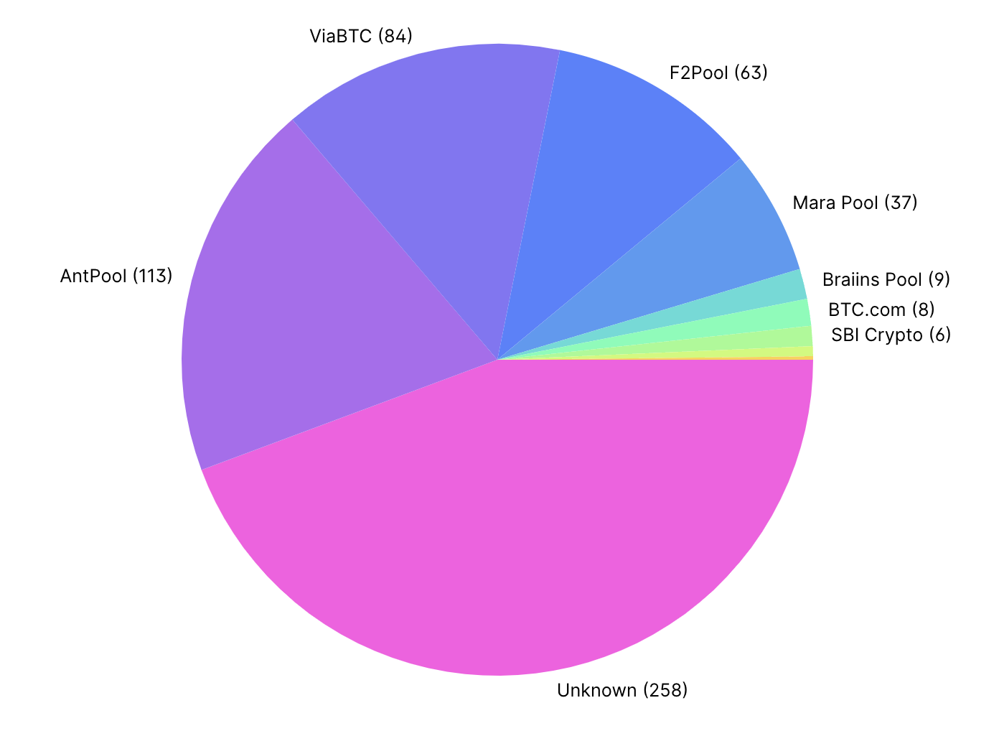
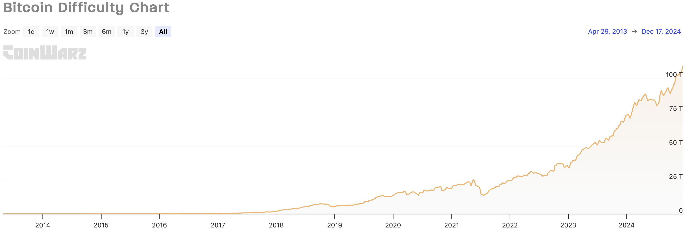

# Борьба с византийскими отказами

## Византийские отказы

Ранее в курсе, когда мы говорили об отказах узлов, как правило мы имели ввиду отказы типа *crash*.
Узел может временно быть остановлен, но при этом в любом случае работает согласно выбранному алгоритму.

Византийские отказы подразумевают, что узлом может управлять злоумышленник и нарочно направлять
некорректные сообщения другим участникам системы, чтобы вывести её из строя. 

Идею византийских отказов Leslie Lamport с коллегами хорошо раскрывает в статье
[The Byzantine Generals Problem](https://lamport.azurewebsites.net/pubs/byz.pdf) на примере византийских
генералов.

### Постановка задачи византийских генералов

Есть несколько генералов, управляющих своими армиями. Генералы могут обмениваться сообщениями
друг с другом и для успешной операции им необходимо договориться о едином решении: 
напасть на крепость или отступить. Известно, что небольшая доля генералов могут оказаться предателями
и захотят помешать всем лояльным генералам договориться до одного и того же плана.

Наша задача &mdash; предоставить план общения для генералов, чтобы все лояльные генералы пришли к одному и
тому же решению. 



*If all generals attack in coordination, the battle is won (left). If two generals falsely declare 
that they intend to attack, but instead retreat, the battle is lost (right) (c) 
[wikipedia](https://en.wikipedia.org/wiki/Byzantine_fault)*

Другими словами &mdash; решить задачу консенсуса для n узлов, где f это число узлов, на которых возможны
византийские отказы.

Алгоритмы консенсуса Raft и Paxos, рассмотренные ранее, пытаются гарантировать safety и liveness
(на практике) в условиях n > 2f. Однако Raft и Paxos не умеют работать с византийскими отказами.
Например, если добавить в Raft византийские отказы, выбранный лидер может успешно отвечать на пробы
реплик-фолловеров (тем самым не будет инициирована процедура выборов), но при этом игнорировать
запросы клиентов, что нарушит свойство liveness (в системе ничего не будет происходить).

В статье доказано, что если n < 3f + 1, то задача не решается.
То есть генералы-предатели всегда смогут своими сообщениями запутать лояльных генералов, чтобы те
не пришли к консенсусу.

На примере трёх узлов (n = 3) с одним византийским отказом (f = 1). Узел-предатель может разослать
другим двум узлам разные команды. Когда другие узлы захотят обменяться между собой командами, они увидят,
что команды их соседей противоречат друг другу. В таком состоянии узлы не смогут понять, какому узлу
можно доверять.


*Источник: The Byzantine Generals Problem (Leslie Lamport, Robert Shostak, Marshall Pease)*

### Practical Byzantine Fault Tolerance

Алгоритм [Viewstamped Replication](https://pmg.csail.mit.edu/papers/vr-revisited.pdf) решает задачу
консенсуса в условиях crash-отказов. Идея заключается в выделении явного лидера (primary-реплики) и бэкап-реплик.

Клиент отправляет запрос лидеру, далее лидер реализует стандартную механику 2 phase commit'а,
дожидаясь успешного ответа от большинства реплик, после чего отвечает клиенту.
Чтобы обеспечить liveness в условиях отказавшего лидера, работа алгоритм разделена на эпохи.
В рамках каждой эпохи выбирается новый лидер. Новая эпоха начинается, когда реплики
подозревают, что старый лидер отказал.


*Источник: Viewstamped Replication Revisited (Barbara Liskov, James Cowling)*

Позднее по мотивам данного алгоритма появляется статья 
[Practical Byzantine Fault Tolerance](https://pmg.csail.mit.edu/papers/osdi99.pdf) (или pBFT), в
которой описывается расширение алгоритма Viewstamped Replication, позволяющее добиться консенсуса
с византийскими отказами при n = 3f + 1. 


*Источник: Practical Byzantine Fault Tolerance (Miguel Castro, Barbara Liskov)*

В рамках pBFT добавляется дополнительная стадия. Причем теперь реплики транслируют сообщение
всем другим репликам. И стадии prepare и commit выполняются репликой только тогда, когда она получает идентичное сообщение
от кворума из 2f + 1 реплик (включая себя) с предыдущих стадий. Это необходимо для того, чтобы гарантировать согласие между корректными репликами относительно порядка запросов. Среди 2f + 1 реплик есть хотя бы f + 1 корректная реплика. Так как всего корректных реплик 2f + 1, то любые два кворума содержат хотя бы одну общую корректную реплику. Поскольку каждая реплика принимает решение один раз, то отсюда следует его единственность.

По итогу ожидается, что после стадии commit как минимум f + 1 корректная реплика ответит клиенту,
что позволит клиенту убедиться, что значение было корректно записано.

Важным аспектом работоспособности алгоритма в условиях византийских отказов является наличие
цифровых подписей. Рядом с каждым сообщением реплика передаёт свою подпись данного сообщения.
Подпись генерируется с помощью секретного ключа, известного только самой реплике. 
Другие же реплики могут проверить корректность подписи с помощью публичного ключа реплики, тем
самым убедившись, что сообщение было действительно отправлено данной репликой. Эту информацию
можно сообщить другим репликам.

Если реплики подозревают, что текущий лидер их обманывает, происходит процедура обновления лидера, 
для обеспечения liveness. При этом лидером становится следующая по очереди реплика:
*new_leader = epoch % num_replicas*.

Подробнее со стадиями работы алгоритма можно ознакомиться в секции 4 [статьи](https://pmg.csail.mit.edu/papers/osdi99.pdf).

### Основные выводы

В условиях наличия византийских отказов
- Показано, что при n < 3f + 1 консенсус не достижим;
- алгоритм pBFT решает задачу при n >= 3f + 1.

## Блокчейн

На практике византийские отказы свойственны децентрализованным системам, где нет доверия к другим пользователям.

Злоумышленники могут нарочно отправлять некорректные сообщения / блокировать отправку сообщений от 
корректных пользователей, чтобы дестабилизировать работу системы.

Хорошей демонстрацией децентрализованных систем являются блокчейн-системы. Рассмотрим основные идеи
самых популярных из них.

### Bitcoin

В 2008 году некий Satoshi Nakamoto опубликовал статью 
[Bitcoin: A Peer-to-Peer Electronic Cash System](https://www.ussc.gov/sites/default/files/pdf/training/annual-national-training-seminar/2018/Emerging_Tech_Bitcoin_Crypto.pdf),
в которой изложена идея некоторой децентрализованной p2p системы, которую можно использовать для
перевода электронных денег без отсутствия контроля со стороны некоторого регулятора.

Отсутствие регулятора (или единого центра) в идеале позволяет избавиться от блокировки счетов и 
бесконечного печатания денег по прихоти какого-то конкретного лица.

#### Ledger book

Говоря про финансовые инструменты и банки мы привыкли оперировать таким понятием как баланс.
Если Алиса переводит $100 Бобу, необходимо увеличить баланс Боба на $100 и уменьшить баланс Алисы
на $100. Можно сказать, что банки поддерживают некоторую hashmap из балансов их пользователей.

Криптовалюты и блокчейн предлагают взглянуть на эту проблему иначе. Давайте каждый узел будет хранить
весь список (лог) транзакций, произошедших в системе. Эта информация будет реплицироваться на все узлы
и храниться на диске. Чтобы узнать текущий баланс пользователя, необходимо пройтись по всему
логу транзакций и просуммировать их.

```
1. $100 Alice -> Bob
2. $50 Bob -> Larry
3. $50 Bob -> Alice
4. $50 Bob -> Alice (DECLINED! Insufficient balance)
...

->

Alice: $50
Bob: $0
Larry: $50
```

#### Транзакции в системе Bitcoin

В Bitcoin переводы возможны между двумя кошельками.

Абсолютно любой человек может получить свой собственный
Bitcoin кошелек, сгенерировав пару публичного адреса и некоторого секретного ключа.
Пример адреса Bitcoin кошелька: `1A1zP1eP5QGefi2DMPTfTL5SLmv7DivfNa`.

В протоколе Bitcoin поддержана возможность транзакций: владелец кошелька может перевести некоторую
сумма биткоинов со своего адреса на некоторый другой кошелек, зная его адрес.

Чтобы удостовериться, что транзакцию действительно совершил владелец кошелька, владелец
подписывает транзакцию с помощью своего публичного кошелька. А так как публичный ключ по сути
является адресом кошелька, известным всем участникам системы, довольно легко можно проверить, что
транзакция легитимная.

Чтобы выполнить транзакцию, необходимо отправить её в систему. Для этого по специальному протоколу
можно связаться с каким-то узлом, про который мы точно знаем, что он подключен к p2p сети, после
чего данный узел с помощью gossip протокола распространит информацию по всей системе. И любой 
пользователь сможет увидеть нашу транзакцию.

Даже если мы подключимся к узлу, который хочет саботировать систему, он не сможет украсть наши деньги,
так как приватный ключ известен нам, а без него не получится создать подпись для транзакции.

Чтобы пользоваться Bitcoin, вам необязательно становиться полноценным участником системы, постоянно
держа свой компьютер включенным. Вы можете общаться по специальному протоколу с серверами, запущенными
другими людьми. И они не украдут ваши деньги... 
Нахождение узла для подключения обычно реализуется с помощью 
[DNS](https://developer.bitcoin.org/devguide/p2p_network.html).

#### Блоки

Далее встает вопрос упорядочивания транзакций. Чтобы уметь валидировать транзакции, не допускать
двойных трат и выхода в отрицательный баланс, мы должны знать точный timestamp каждой транзакции.

Но верить timestamp'ам в распределенной системе с византийскими отказами - не лучшая идея.
Поэтому Bitcoin предлагает поделить временное пространство на блоки по ~10 минут. 

Когда происходит генерация транзакции, она попадает в ближайший блок из транзакций. Таким образом,
номер блока позволяет выделить некоторый логический timestamp в нашей системе. Теперь мы можем
упорядочить транзакции по блокам. 

Если вы хотите оплатить продукты в магазине, мы совершаете транзакцию, дожидаетесь формирования 
очередного блока, после чего продавец получает информацию о новом блоке и видит, что там есть ваша
транзакция.

При этом каждый блок ссылается на предыдущий блок (содержит его хеш), что позволяет выстроить 
ту самую цепочку из блоков (block chain).



При генерации очередного блока, информация об этом блоке распространяется по всем участникам системы.
Узлы системы принимают входящие блоки, валидируют их (сверяют баланс), и записывают к себе на диск.
Если злоумышленник попытается распространить блок с некорректной транзакцией 
(некорректная подпись, отрицательный баланс), данный блок просто не будет принят другими участниками, 
так как это вредит системе и обесценит криптовалюту.

Отменить транзакцию, попавшую в блок, не получится.

#### Выбор лидера

Кто-то должен генерировать новый блок каждые 10 минут, а значит, должен быть какой-то выделенный лидер?
Но как организовать выборы лидера в системе, где никто не может доверять друг другу?

В Bitcoin нету явно выделенного лидера. Консенсус достигается за счет подхода Proof of Work. 
Любой участник сети может сгенерировать новый блок и включить туда набор транзакций, которые
понравились данному участнику системы. Однако чтобы другие участники системы приняли этот блок,
необходимо правильно решить вычислительно сложную задачу.

Процесс генерации нового блока называется **майнингом**. А узел, занимающийся генерацией новых блоков,
называется **майнером**.

Структура [блока](https://en.bitcoin.it/wiki/Block) имеет следующий вид:


*Источник: https://www3.ntu.edu.sg/home/ehchua/programming/blockchain/bitcoin.html*

Заголовок блока состоит из 
- ссылки на предыдущий блок (хеша), чтобы не потерять историю блоков
- хеша [Merkle дерева](https://en.wikipedia.org/wiki/Merkle_tree) из транзакций, которые включены в этот блок
- некого значения `target`
- и некоторого целочисленного значения `nonce`

Чтобы блок был принят, майнеру необходимо подобрать такой `nonce`, что [значение хеша от заголовка
блока](https://en.bitcoin.it/wiki/Block_hashing_algorithm) будет меньше значения `target`. 
На практике это значит, что майнер должен перебирать `nonce`,
чтобы полученный хеш блока имел несколько лидирующих нулей.

Причем `target` не может быть произвольным. Это [некоторая константа](https://en.bitcoin.it/wiki/Target), 
до которой договорились все участники системы, чтобы подбор `nonce` был действительно долгой 
процедурой, которая в среднем занимала бы порядка 10 минут.

Когда какому-то узлу системы удаётся сгенерировать удачный `nonce`, майнер распространяет информацию
об этом блоке всем участникам системы с помощью gossip протокола. Далее блок добавляется в цепочку.

Как можно догадаться, в условиях большого числа участников системы, возможны коллизии. Несколько
узлов могут подобрать удачный `nonce` примерно в одно и то же время, и оба блока будут корректны
с точки зрения системы. По итогу часть системы примет один блок, а оставшиеся участники - другой блок.


*Источник: https://vas3k.blog/blog/blockchain/*

Стоит учесть, что хеш считается именно от хеша блока, который в себе содержит хеш от списка транзакций, 
которые были включены в данный блок. 
Это позволяет ускорить процедуру подсчета хеша, но при этом на момент перебора `nonce` майнер 
уже должен определиться, какие транзакции будут включены в блок.

Как только узел видит, что какой-то другой узел сгенерировал очередной блок, начинается сбор 
транзакций для нового блока и подбор `nonce` для нового заголовка.

Получается, ценность Bitcoin'у мы даём за счёт оплаты счетов за процессоры и
электричество, которые тратят энергию "впустую", чтобы обеспечивать liveness алгоритму.

Это не остановит работу системы. В течение какого-то времени будет поддерживаться несколько "веток".
Но скорее всего доля мощностей у этих веток будет неравномерная. И тот блок, который быстрее 
распространился по системе и завоевал внимание большей группы узлов (с точки зрения суммарной
мощности), сможет смайнить другие блоки быстрее. Узлы, видя более длинную цепочку, выбирают её.


*Источник: https://vas3k.blog/blog/blockchain/*

Посмотреть на состояние блокчейна Bitcoin можно на различного рода 
[explorer'ах](https://www.blockchain.com/explorer/blocks/btc/875203).
Как правило там есть информация о всех последних блоках и содержимом этих блоков.

#### 51% attack

Если вашей транзакции не оказалось в ветке блокчейна, которая будет более длинной, транзакция
будет отброшена. Таким образом возможна проблема так называемого **double spent**.

Вы можете прийти в магазин, совершить транзакцию, показать информацию об этом продавцу и уйти
с продуктами. Далее ветка блокчейна с вашей транзакцией будет отброшена и вы сможете потратить 
биткоины еще раз.


*Источник: https://vas3k.blog/blog/blockchain/*

Поэтому на практике как правило дожидаются создания шести блоков поверх блока, куда попала ваша транзакция.
Вероятность, что после шести новых блоков произойдет отмена ветки, очень мала.

К этой ситуации часто обращаются при обсуждении проблемы [51% attack](https://www.investopedia.com/terms/1/51-attack.asp).
Если найдется организация, которая купит много компьютеров и начнет контролировать более 50% мощностей
в системе, система по сути станет централизованной.

Теперь данная организация сама будет выбирать какие транзакции пропускать, а какие &mdash; нет.
Также появится возможность делать "откаты" веток, делая параллельные вычисления.

На практике это труднодоступно, однако в блокчейнах с небольшим числом участников вполне возможны.
В условиях Bitcoin это скорее всего будет неразумно с точки зрения капитала, так как если это вскроется
стоимость Bitcoin резко упадёт.

#### Мотивация для майнеров

Может возникнуть вопрос &mdash; а зачем вообще майнерам покупать компьютеры, платить за электричество?
Что они получают в замен?

Каждый майнер, который подберет нужный `nonce`, в качестве вознаграждения получает некоторую сумму в 
биткоинах. На заре биткоина каждый замайненный блок приносил майнеру [50 BTC](https://en.bitcoin.it/wiki/Mining).

Награда за блоки является естественным способом появления новых биткоинов в системе.
Когда Bitcoin только запустился, у всех кошельков был нулевой баланс. Далее кто-то смайнил первый блок,
получил 50 BTC, перевел какую-то часть BTC на другие кошельки, и так далее...

При этом у создателей Bitcoin была идея ограничить эмиссию валюты. Суммарно будет выпущено 21 млн биткоиов.
Награда за очередные блоки постепенно уменьшается, чтобы придавать больше ценности BTC. 

Пересчет награды на блоки называется halving. Каждые 4 года награда за блок уменьшается в два раза.
В декабре 2024 года награда за блок составляет 3.125 BTC.

Награда за блок учитывается в качестве самой первой транзакции в блоке в адрес кошелька майнера,
добывшего этот блок. Таким образом хеш блока и подобранный `nonce` учитывает эту транзакцию, что
не позволит другим участникам системы присвоить блок себе. В блоке уже учтено, кто его замайнил.

При этом если майнер не захочет в очередной раз уменьшать награду в два раза, другие узлы
просто отклонят данный блок за несоблюдение контракта.

Период в 4 года отмеряется с помощью блоков. Мы знаем, что один блок генерируется в среднем раз 
в 10 минут. Значит халвинг необходимо делать раз в 210000 блоков, что заложено в реализации
протокола Bitcoin.

#### Ограничения на размер блока

Содержимое всех блоков, все транзакции, реплицируются на диске всех участников системы. 
В случае, если какая-то небольшая доля участников отключится, информация не будет потеряна.

Это приводит к тому, что на данный момент размер блокчейна Bitcoin составляет порядка 
[630 GB](https://ycharts.com/indicators/bitcoin_blockchain_size). Это много...

На практике каждая транзакция занимает сколько-то байт на диске. Чтобы диск не исчерпывался слишком
быстро, максимальный размер блока ограничен 
[несколькими мегабайтами](https://bitcoinwiki.org/wiki/block-size-limit-controversy#:~:text=Blocks%20size%20in%20blockchain%20is,larger%20than%201MB%20is%20invalid.).

Это значит, что майнер скорее всего не сможет включить все транзакции, которые ожидают добавления в блок.
Если включить их все, размер блока станет слишком большим, и участники системы откинут этот блок.

Чтобы мотивировать майнеров включить транзакцию в очередной блок, отправитель транзакции
может определить комиссию (miner's fee), которая будет переведена майнеру, если тот возьмет данную
транзакцию к себе в блок.

Обычно майнеры включают в блок максимальное число транзакция с самым большим miner's fee. 
Но это приводит к ограничению пропускной способности всей системы. Bitcoin обеспечивает обработку
порядка 5 транзакций в секунду (около 3000 транзакций в блок, генерирующийся раз в 10 минут).
Для сравнения &mdash; платёжные системы Visa способны обрабатывать десятки тысяч денежных транзакций
в секунду.

По итогу у майнеров существует два вида мотивации: награда за блок и комиссия. Даже когда эмиссия
биткоина остановится, отправители транзакций будут платить комиссию, чтобы стимулировать
майнеров включать свои процессоры.

#### UTXO (Unspent Transaction Output)

Ранее мы обсуждали, что майнер не может украсть наши деньги, так как он не сможет 
создать подпись для транзакции от лица нашего кошелька.

Но если мы совершили транзакцию, мы сообщили подпись данной транзакции.
Как запретить майнеру дублировать нашу транзакцию, что приведет к исчерпанию средств на кошельке?
Для решения этой задачи в Bitcoin используется модель "одноразовых" результатов операции.

На самом деле каждая транзакция принимает некоторый набор не потраченных output'ов и формирует новые
output'ы. Output &mdash; это некоторая сумма в Bitcoin, принадлежащая какому-то кошельку.
[Unspent Output](https://en.wikipedia.org/wiki/Unspent_transaction_output) &mdash; 
это сумма в Bitcoin, которая еще не была потрачена.

Чтобы сформировать транзакцию, мы должны потратить какие-то имеющиеся у нас UTXO и сформировать новые.

Если у нас есть один большой output на 10 BTC, а мы хотим перевести Алисе 0.05 BTC, в результате 
транзакции будет сформировано несколько output'ов:
- output на 0.05 BTC, принадлежащий Алисе
- output на ~9.95 BTC, принадлежащий нам
- output с небольшой суммой BTC в качестве комиссии майнеру

Таким образом майнер не может дублировать наши транзакции. Каждая транзакция будет требовать
новой подписи, так как её содержимое (набор output) будет меняться.


*Источник: https://river.com/learn/bitcoins-utxo-model/*

#### Объединения майнеров

В майнинге блоков участвуют десятки (сотни) тысяч компьютеров. Если вы подключитесь к процессу майнинга
со своего ноутбука, вероятность замайнить очередной блок будет очень мала. Поэтому обычно
майнеры вступают в так называемые пулы.

Существуют организации, которые объединяют в себя много мощностей, и если кто-то из участников
данного пула замайнит блок, награда пойдет владельцу пула, и он распределит её среди участников
пула согласно мощностям, предоставляемым данными участниками.

Ниже представлено текущее распределение мощностей по пулам.



*Источник: https://www.blockchain.com/explorer/charts/pools*

#### Пересчёт сложности

Система стремится к тому, чтобы каждый блок генерировался раз в 10 минут.
Ранее это было оправдано: распространение информации о новом блоке занимает некоторое время, хотелось
сделать это время незначительным относительно времени генерации блока.

Но число участников и мощность компьютеров, участвующих в майнинге, постоянно меняется. 
Использование `target`'a, который был актуален в 2010 и позволял майнить блок за 10 минут,
привело бы к тому, что в 2024 году новый блок находили бы за единицы секунд.

Чтобы избежать этого был изобретен механизм [пересчитывания сложности](https://en.bitcoin.it/wiki/Difficulty).
Каждые 2016 блоков все узлы системы "осматриваются назад" и смотрят, какое было среднее
время майнинга предыдущих 2016 блоков.
 
Исходя из этой информации, `target` увеличивается или уменьшается, чтобы среднее время приблизить к 10 минутам.

Ниже представлен график изменения сложности майнинга (target'a):



#### Синхронизация времени

Чтобы поддерживать актуальную сложности майнинга, нам необходимо знать настоящие timestamp'ы
каждого блока. Но так как мы работаем в рамках не доверенной p2p системы, нельзя верить значениям,
которые проставляют майнеры.

Поэтому к timestamp'у очередного блока предъявляются к следующие требования:

> A timestamp is accepted as valid if it is greater than the median timestamp of previous 11 blocks, 
    and less than the network-adjusted time + 2 hours. "Network-adjusted time" is the median of the 
    timestamps returned by all nodes connected to you. As a result block timestamps are not exactly 
    accurate, and they do not need to be. Block times are accurate only to within an hour or two.

*Источник: https://en.bitcoin.it/wiki/Block_timestamp*

### Ethereum

Ethereum появился позже Bitcoin и сильно расширил его идею за счёт смарт-контрактов.

#### EVM

В рамках блокчейна Ethereum существует виртуальная машина (Ethereum Virtual Machine).

У участников системы есть возможность не только переводить средства друг другу,
но и сохранить код на специальном языке программирования Solidity, а в дальнейшем с помощью
отправки транзакций можно будет исполнять данный код.

В транзакции можно будет передать хеш интересующего смарт-контракта, название функции из данного
смарт-контракта и набор аргументов для вызова данной функции. В результате участники системы 
выполнят желаемый код.

Мы привыкли, что код работает с некоторым состоянием. Мы пользуемся контейнерами vector, map 
и так далее.

Рядом с "кодом" каждого смарт-контракта сохраняется его состояние. При вызове очередной функции,
EVM подгружает состояние с диска в память, выполняет обработку кода, и сохраняет измененное состояние на диск.
То есть теперь каждый участник системы помимо набора транзакций хранит инструкции для выполнения и
состояния контрактов.

У каждой [инструкции](https://ethereum.org/en/developers/docs/evm/opcodes/) 
(сложение, умножение, и т. д.) есть стоимость её выполнения. Данная стоимость уходит с баланса
отправителя транзакции (инициатора вызова функции) на баланс майнера, который смог получить очередной блок.

С помощью идеи смарт-контрактов можно сильно расширить возможности блокчейна.
В рамках Ethereum можно создавать другие валюты (которые часто называют токенами). 
Достаточно создать смарт-контракт, в котором будет поддержана функция выдачи токенов
(она может быть доступна для вызова только владельцу смарт-контракта) и функция перевода токенов
с одного адреса на другой; а баланс кошельков можно сохранить в состоянии смарт-контракта.

[NFT](https://eips.ethereum.org/EIPS/eip-721) (Non-Fungible Token Standard) это как раз таки 
интерфейс для смарт-контрактов. То есть вы можете определить свой собственный смарт-контракт, 
который будет определять владение некоторым цифровым объектом и возможность передачи права владения
от одного кошелька к другому.

## Полезные ссылки

- [From Viewstamped Replication to Byzantine Fault Tolerance](https://pmg.csail.mit.edu/papers/vr-to-bft.pdf) &mdash;
  подробная статья с идеями алгоритма консенсуса Viewstamped Replication и pBFT.

- [Bitcoin: A Peer-to-Peer Electronic Cash System](https://www.ussc.gov/sites/default/files/pdf/training/annual-national-training-seminar/2018/Emerging_Tech_Bitcoin_Crypto.pdf) &mdash;
  оригинальная статья про Bitcoin.

- [Блокчейн изнутри: как устроен блокчейн](https://vas3k.blog/blog/blockchain/) &mdash; 
  хороший русскоязычный научпоп-лонгрид про устройство Bitcoin.

- [Blockchain.com](https://www.blockchain.com/explorer) &mdash; публичный explorer, 
  где можно посмотреть состояние сети Bitcoin: состав блоков, балансы, ...

- [Bitcoin Mempool](https://mempool.space/) &mdash; информация о текущем наборе транзакций, 
  ожидающих добавления в блок.

- [Bitcoin UTXO](https://trustwallet.com/blog/what-is-a-utxo-unspent-transaction-output) &mdash;
  что мешает майнеру-злоумышленнику дублировать наши транзакции.

- [Solidity Examples](https://docs.soliditylang.org/en/latest/solidity-by-example.html) &mdash; 
  пример кода на языке смарт-контрактов Solidity.